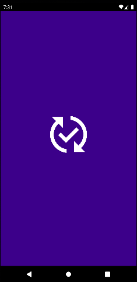

# Habit Tracker App

A Flutter-based application designed to help users track and visualize their daily habits effectively. The app allows users to build good habits, break bad ones, and monitor their progress over time with a visually appealing heatmap. It's the perfect tool for anyone aiming to improve their daily routine.

## Features

- **Habit Tracking**: Add, edit, and delete habits with ease.
- **Mark Habits as Completed**: Track your daily progress with a simple tap.
- **Monthly Heatmap**: Visualize your habit completion trends over time.
- **Custom Themes**: Toggle between light and dark themes to match your preferences.
- **Statistics**: View detailed habit statistics using graphs and charts.
- **Icon Picker**: Select icons for your habits using flutter_iconpicker_plus.
- **Splash Screen**: Customizable splash screen with flutter_native_splash.

## Screenshots

|  |  |  |
|:------------------------------------------:|:--------------------------------------------:|:--------------------------------------:|
|         **Splash Screen**                    |         **Home Screen**                   |        **Add Habit Page**            |

|  |  |  |
|:--------------------------------------------:|:--------------------------------------------:|:------------------------------------------:|
| **Theme Settings && Habit Summary**                          | **Habit Summary**                           | **Other Theme**                          |

## Demo Video

Check out the demo of the app in action:

https://github.com/user-attachments/assets/2016d062-8895-4355-ae65-bd91ffdb34ea


## Installation

To run this project locally, follow these steps:

1. **Clone the repository**:
   ```bash  
   git clone https://github.com/OmarZen/habit-tracker.git  
   ```  

2. **Navigate to the project directory**:
   ```bash  
   cd habit-tracker  
   ```  

3. **Install dependencies**:
   ```bash  
   flutter pub get  
   ```  

4. **Run the app on an emulator or connected device**:
   ```bash  
   flutter run  
   ```  

## Packages Used

- **flutter**: The core Flutter framework for building the app.
- **cupertino_icons**: Provides iOS-style icons.
- **easy_date_timeline**: Date-based navigation for habit tracking.
- **flutter_hooks** & **hooks_riverpod**: For state management in a reactive way.
- **drift & drift_flutter**: Local database management.
- **rxdart**: For reactive programming.
- **intl**: Internationalization and date formatting.
- **path** & **path_provider**: File and path management.
- **fl_chart**: For creating charts and visualizing habit statistics.
- **flutter_iconpicker_plus**: For selecting custom icons for habits.
- **flutter_native_splash**: Customize the splash screen.
- **provider**: State management solution for Flutter apps.

## How It Works

1. **Create a Habit**: Add a new habit by providing a name and an icon.
2. **Mark Completion**: Tap on a habit to mark it as completed for the day.
3. **Monitor Progress**: Use the monthly heatmap to visualize your habit completion over time.
4. **View Statistics**: Check out the graphs and charts for a deeper insight into your habit consistency.

## Future Improvements

- Add notifications and reminders for incomplete habits.
- Implement syncing across devices using cloud storage.
- Improve habit analytics with more advanced visualizations.

## Contribution

Contributions are welcome! If you'd like to improve this project:

1. Fork the repository.
2. Create a new branch (`feature/your-feature-name`).
3. Commit your changes.
4. Open a pull request.

## Contact

Feel free to reach out if you have any questions or suggestions!

- **Author**: Omar Walid
- **Email**: [omarwaleedzenhom2002@gmail.com]
- **Telegram**: [@OmarZenhom](https://t.me/OmarZenhom)
